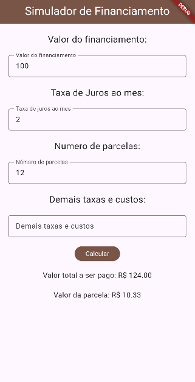

# Juros APP

## Tecnologias
- Flutter

## Passo a passo para testar este códico
- 1 Clone este repositório.
- 2 Abra com VsCode, instale as dependências e execute o lib/main.dart
```bash
flutter pub get
flutter run
```

## Pictures



